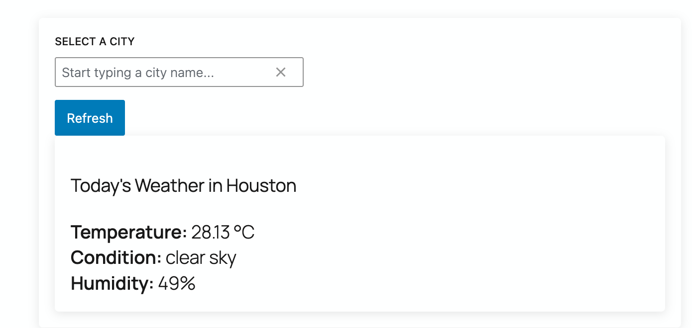

## A Gutenberg Weather Block

#### Description:
* A WordPress plugin that displays weather information using the Gutenberg block
* Weather data is fetched from OpenWeatherMap api and saved to post meta; This mean that weather data won't change unless you manually update it. You do have the option to specify the city name when adding the block;
* API key is **configurable** in the admin setting page for weather block.
* I didn't want to expose the **apiKey**, although this key is not that important.
* As best practice, I use babel to transpile my js file for JSX support and ES6 compatibility.
* Between ***registering block with php*** and ***registering block with javascript***, I opted for the later expecting that I will have complex interactivity later.

